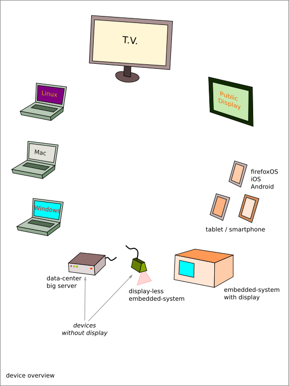

=====================================
notes on concepts for User-Interfaces
=====================================

Graphical User Interfaces
=========================

Device exploration
------------------

A list of devices that could provide a graphical-user-interface:

- laptop

  - Linux
  - Mac
  - Windows

- smartphone
- tablet
- high-performance-computing server without screen
- embedded-systems

  - with a display (e.g. washing machine)
  - without display (e.g. PTZ-camera)

- public display (like in a train-station)
- TV-device or projector
- laser-show (or exotic display systems)

Rules
-----

The devices without screen (small embedded-systems or HPC-servers) can offer a GUI only through the Web.

Except the very-small-embedded-system-with-display and the exotic-display-system, all devices are Web-browser compliant.

GUI solutions
-------------

- Qt

  - Qt supports
  
    - laptop applications
    - Android/iOS app
    - parsimonious C/C++ embedded application

  - Pros

    - Conventional programming (i.e. one language)
    - Performance, not CPU-demanding
    - Run also on small embedded systems
  
  - Cons

    - less portable
    - cumbersome design

- Web (html/css/js)

  - Web-techno supports

    - Web (first class citizen and only citizen)
    - PWA (Progressive Web App)
    - laptop applications using *electron*
    - Andoid/iOS app using *ionic* or *cordova*

  - Pros

    - Better code reuse from one platform to another
    - Ease to personalize the design
    - More declarative configuration, less pure programming

  - Cons

    - Heavy stack demanding CPU resources

Programming languages
=====================

As all Graphical-User-Interfaces converge to the Web-technology, *javascript* becomes the language for UI.

- C++ is for high-performance routines.
- Python is for fast-prototyping.

